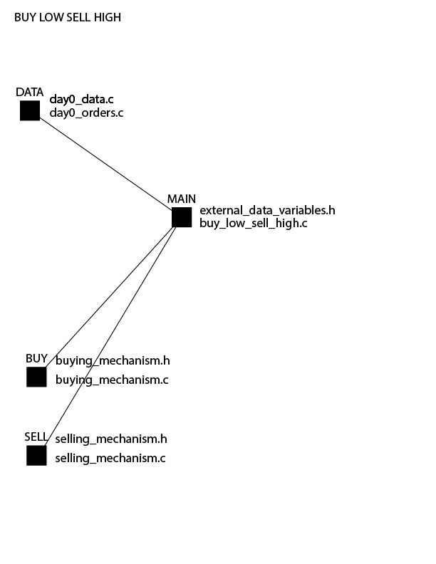

# This algorithm is made up of several parts.

	main_mechanism
	    buy_low_sell_high.c
	    external_data_variables.h

    buy_mechanism
        buying_mechanism.c
        buying_mechanism.h

	sell_mechanism
	    selling_mechanism.c
	    selling_mechanism.h

# This algorithm is recieving data from the infastructure.

The data is inputted into the data folder.

There are two files:

	day0_data.c
	day0_orders.c

## day0_data.c is the file that has the currency pair price points.

## day0_orders.c is the file that has the output of the algorithm that will determine if a currency pair is a buy or not a buy order.

