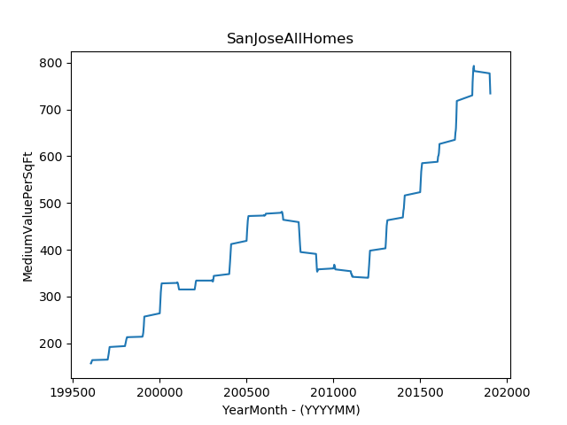

# San Jose Medium Value Per SQ FT All Homes Matplot

With Matplotlib which is a data science Python Library, we are able to make simple visual plots.

In this example, we will be working with data from the Zillow API.

First we can get access to this data for free from the Zillow Website.

Just do a search for this data because the link may change.

Here is the graph.

# Source Code

    # This Script plots a linear graph.
    # The data is All Homes in San Jose the Medium Value Per SQ/FT.
    # X Data entered in YYYYMM Format 
    # YYYY = Year : example 1996 and MM = Month : example 01
    # So January 1996 is 199601
    # Y Data is Value per SQ/FT

    # Import matplotlib 
    from matplotlib import pyplot as plt

    # Plot function
    # X,Y Graph
    plt.plot(
        [
            199604, 199605, 199606, 199607, 199608, 199609, 199610, 199611, 199612,
            199701,199702,199703,199704,199705,199706,199707,199708,199709,199710,199711,199712,
            199801,199802,199803,199804,199805,199806,199807,199808,199809,199810,199811,199812,
            199901,199902,199903,199904,199905,199906,199907,199908,199909,199910,199911,199912,
            200001,200002,200003,200004,200005,200006,200007,200008,200009,200010,200011,200012,
            200101,200102,200103,200104,200105,200106,200107,200108,200109,200110,200111,200112,
            200201,200202,200203,200204,200205,200206,200207,200208,200209,200210,200211,200212,
            200301,200302,200303,200304,200305,200306,200307,200308,200309,200310,200311,200312,
            200401,200402,200403,200404,200405,200406,200407,200408,200409,200410,200411,200412,
            200501,200502,200503,200504,200505,200506,200507,200508,200509,200510,200511,200512,
            200601,200602,200603,200604,200605,200606,200607,200608,200609,200610,200611,200612,
            200701,200702,200703,200704,200705,200706,200707,200708,200709,200710,200711,200712,
            200801,200802,200803,200804,200805,200806,200807,200808,200809,200810,200811,200812,
            200901,200902,200903,200904,200905,200906,200907,200908,200909,200910,200911,200912,
            201001,201002,201003,201004,201005,201006,201007,201008,201009,201010,201011,201012,
            201101,201102,201103,201104,201105,201106,201107,201108,201109,201110,201111,201112,
            201201,201202,201203,201204,201205,201206,201207,201208,201209,201210,201211,201212,
            201301,201302,201303,201304,201305,201306,201307,201308,201309,201310,201311,201312,
            201401,201402,201403,201404,201405,201406,201407,201408,201409,201410,201411,201412,
            201501,201502,201503,201504,201505,201506,201507,201508,201509,201510,201511,201512,
            201601,201602,201603,201604,201605,201606,201607,201608,201609,201610,201611,201612,
            201701,201702,201703,201704,201705,201706,201707,201708,201709,201710,201711,201712,
            201801,201802,201803,201804,201805,201806,201807,201808,201809,201810,201811,201812,
            201901,201902,201903,201904,201905
            ], 
        [
            157,158,158,159,160,161,162,163,164,165,167,168,170,173,175,178,181,184,187,
            189,192,194,197,198,200,202,204,206,207,209,210,211,213,214,215,216,218,221,
            223,227,231,237,243,249,257,264,272,280,288,296,303,309,314,318,322,325,328,
            329,330,330,329,328,327,325,322,320,318,316,315,315,315,317,319,321,324,327,
            329,332,333,334,334,334,335,334,334,333,332,332,333,335,337,340,344,348,353,
            358,363,369,375,381,386,392,398,405,412,419,427,433,440,446,452,458,462,466,
            468,470,472,473,474,474,473,473,473,474,474,474,475,476,477,479,480,481,481,
            481,480,479,477,475,472,468,464,459,454,448,442,435,428,421,415,410,404,399,
            395,391,386,379,371,364,358,354,353,354,355,356,358,360,361,361,364,367,368,
            367,366,365,364,361,358,354,351,349,348,348,348,347,345,343,343,344,342,340,
            342,347,352,356,361,368,375,381,387,393,398,403,408,414,422,430,440,448,451,
            454,456,459,463,469,474,478,482,485,486,489,495,500,505,510,516,523,531,538,
            545,553,561,567,571,576,580,583,585,588,592,596,599,600,601,602,604,607,612,
            618,626,635,641,646,650,652,655,660,668,679,693,707,718,730,746,758,766,777,
            785,787,787,791,793,788,782,777,767,755,744,734
            ])

    # Add Title to top of Graph
    plt.title('SanJoseAllHomes')
    # Add Label to X axis
    plt.xlabel('YearMonth - (YYYYMM)')
    # Add Label to Y axis
    plt.ylabel('MediumValuePerSqFt')

    # Outputs the graph to png format
    plt.savefig('plot.png')