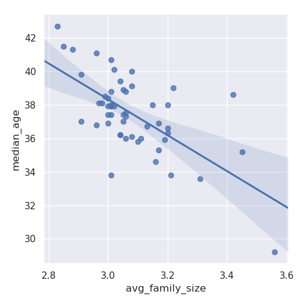

# The API Response and Pandas

First import the python dependencies

    # Import requests
    import requests
    # Import pandas
    import pandas as pd
    # Import seaborn
    import seaborn as sns
    sns.set()

We will load data from the API response object into a pandas data frame.

    # Construct the data frame
    col_names = ["name", "median_age", "avg_family_size", "state"]
    states = pd.DataFrame(columns = col_names, data = r.json()[1:])

Make sure to skip the first because it is just the old value names of the dataset

    [1:]

We will assign user-friendly column names and convert the values from strings to appropriate data types.

    # Convert each column with numeric data to an appropriate type
    states["median_age"] = states["median_age"].astype(float)
    states["avg_family_size"] = states["avg_family_size"].astype(float)

After creating the data frame, run the script to generate a scatterplot to visualize the data between the relationship between average family size and the medium age in the US.

    # Scatterplot with regression line
    sns.lmplot(x = "avg_family_size", y = "median_age", data = states)
    plt.show()

Here is the picture of the graph.
