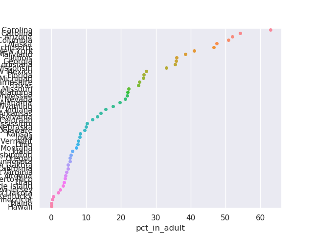

# API to Visualization: Group Quarters

We'll now look into where juvenile offenders are incarcerated.

## Group Quarters

This concept includes college dorms, correctional facilities, nursing homes, military bases, etc.

## Visualization

We will visualize the percentage, by state, of incarcerated minor males in adult correctional facilities. 

## Variables

PCT021005 - Male: Under 18 years: Institutionalized population: Correctional facilities for adults

PCT021015 - Male: Under 18 years: Institutionalized population: Juvenile facilities: Correctional facilities intended for juveniles

First import python dependencies.

    # Import requests
    import requests
    # Import pandas
    import pandas as pd
    # Import matplotlib
    import matplotlib.pyplot as plt
    # Import seaborn
    import seaborn as sns
    sns.set()

Now we will build the base URL.

    # Build base URL
    HOST = "https://api.census.gov/data"
    year = "2010"
    dataset = "dec/sf1"
    base_url = "/".join([HOST, year, dataset])

Let's specify the variables that we are going to request from the API.

    # Specify variables and execute API request
    get_vars = ["NAME", "PCT021005", "PCT021015"]
    predicates = {}
    predicates["get"] = ",".join(get_vars)
    predicates["for"] = "state:*"
    r = requests.get(base_url, params=predicates)

Now we will construct the data frame.

    # Construct data frame
    col_names = ["name", "in_adult", "in_juvenile", "state"]
    states = pd.DataFrame(columns=col_names, data=r.json()[1:])
    states[["in_adult", "in_juvenile"]] = states[["in_adult", "in_juvenile"]].astype(int)

Get the percentage of the juvilles in adult incarcerated group quarters, compared to the total which is juvilles in adult and juville group quarter. This will be the pct_in_adult state.

    Calculate percentage of incarcerated male minors in adult facilities
    states["pct_in_adult"] = ((100*states["in_adult"])/(states["in_adult"]+states["in_juvenile"]))

Now sort the values.

    states.sort_values(by = "pct_in_adult", ascending = False, inplace = True)

Create the graph.

    sns.stripplot(x = "pct_in_adult", y = "name", data = states)

Finally use matplotlib to generate the graph.

    plt.show()

## US Juvenile Incarceration per state

