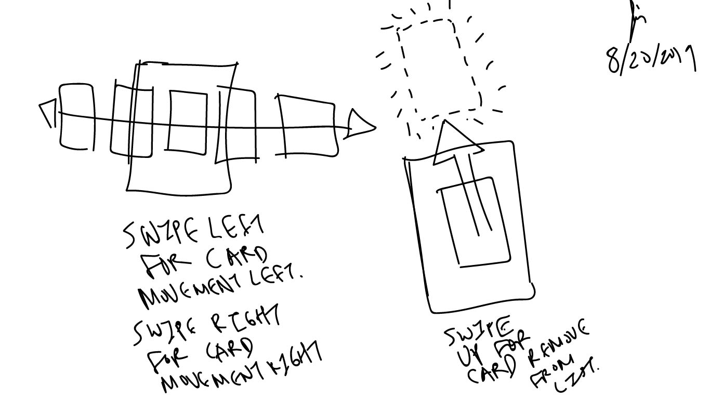

# Swipe movement card list

This is a conceptual sketch of an interaction for a mobile device.

It is actually a quite common interaction in various applications.

But in this case, all the cards are displayed horizontally.

This is used in the Samsung's one UI design framework.

When looking at all open apps on the phone, this interaction is used.

For Apple, the interaction is also very similar, except they show the applications vertically.
