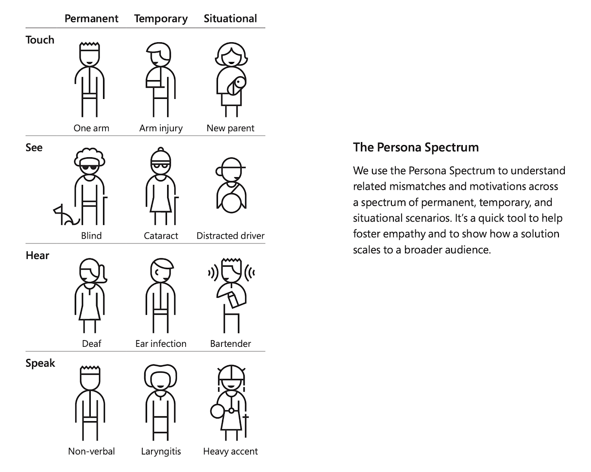

# Persona Spectrum Limitation

There are certain Personas that we design for that particular in which they have certain types of limitations.

For example according to Microsoft there are the following:

## Touch

## See

## Hear

## Speak

Of those there are scales of limitations:

## Permanent

## Temporary

## Situational
